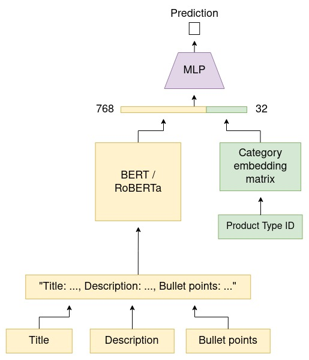

# Amazon ML
## Placed 2nd out of ~7k teams, 26k participants across India in the [Amazon ML Challenge 2023](https://www.hackerearth.com/challenges/new/competitive/amazon-ml-challenge-2023/)
**Team Fishes 🐠: [Tashvik Dhamija](https://github.com/TashvikDhamija), [Pranav Balaji](https://github.com/greenfish8090), [Adarsh Jha](https://github.com/Adarsh-Jha)**

\
This is our code for the hackathon where participants were tasked with developing a machine learning model that can accurately predict the length dimension of a product. Given that product length is crucial for packaging and storing products efficiently in the warehouse, and that it is also an important attribute that customers use to assess the product size before purchasing, this is an important task. The dataset provided included 2.2 million products, each with a product title, description, bullet points, product type ID, and product length.

We followed a series of steps:

1. We first performed exploratory data analysis (EDA) to understand the distribution of the target values. We observed that the data was heavily skewed, concentrated with a lot of outliers, and approximately normal.
2. We then preprocessed the data in the following ways:
   1. We concatenated all the text features (product title, description, bullet points) into one to provide maximum context for BERT embeddings.
   2. We took the logarithm of the target values to fix skewness.
   3. We clipped the logarithm of the target values at 12 to remove outliers.
   4. We normalized the data using the mean and standard deviation.
3. In the first step, we used frozen BERT to generate embeddings and trained a shallow artificial neural network (ANN) to predict the preprocessed target values. This approach gave us a good result, but we knew that there was still room for improvement.
4. In the second step, we finetuned both a BERT and a RoBERTa model on the dataset. During finetuning, we additionally learned an embedding dictionary for each product type (represented by product type ID). In an end-to-end fashion, the BERT/RoBERTa model, category embedding dictionary, and regressor were trained. We found that this approach significantly improved the accuracy of our predictions.
5. Finally, we used the best performing models for BERT and RoBERTa to predict the values of the test set. We rounded off the predicted values to the nearest value in the training set since various products tended to have the same or similar lengths. Then we take the minimum of the value from the outputs of BERT and RoBERTa in order to negate the skewness that makes the model biased towards predicting higher values.
\

Overall, our approach demonstrated that the use of pre-trained language models such as BERT and RoBERTa can significantly improve the accuracy of predicting product lengths. Additionally, by combining the outputs of two different models and ensembling them, we were able to achieve even better performance.

\
Architecture diagram:\

Scope for improvement:
- Better data preprocessing - outlier removal
- Larger LM
- Unsupervised domain adaptation
